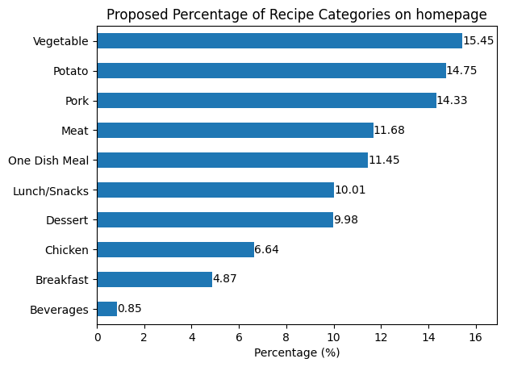

# Tasty Bytes Report
## Project Overview and Business Goals
Tasty Bytes displays recipes on their home page according to their Product Manager's and traffic to the rest of the website goes up by as much as 40% if it's a popular one.  
More traffic means more subscriptions so **the company wanted us to predict correctly which recipes would be popular 80% of the time** and minimize the chance of showing unpopular recipes.

## Procedure followed
1. Cleaned and Validated Data
2. Performed Exploratory Data Analysis (EDA)
3. Developed and Evaluated a Model
4. Defined a KPI for the business to monitor
5. Made suggestions for improvement based on findings

## Key EDA insights

Displaying the Product Manager's favorite recipes on their homepage, has led in high traffic 60% of the times.

The recipe category is the key variable associated with high traffic. 

There's very high percentage of Vegetable, Potato and Pork recipes that has led to high traffic.

## Outcome of model training
The best model I tried, **predicted correctly high traffic recipes 84% of the time** so it surpassed the 80% goal set.

## Business Recommendations

As variety should exist to retain customers' interest, I would propose **the frequencies of the categories of the recipes displayed on the homepage, to match the order and proportion they hold in the Percentage of Popular Recipes by Category** graph to try going along with the current trend in the market.

**Keep track of the evolving trends** as with the model deployment, popular recipes from all categories will appear more often and may attract many new customers, who might soon change the current trend!

Also, **for the categories with low popularity (Beverages, Breakfast, Chicken) I suggest Tasty Bytes create many subgroups - not visible to the customers (or visible as tags), just for better analysis - for each one** (for example the Breakfast category could have different features for every element it includes as eggs, bacon, milk, tea, juice, fruit etc) so that it would be easier to identify which of them increase the chances to be popular, as it seems that the category of the recipe is the decisive factor for being popular or not.
Moreover, **'Time to make' and 'Cost per serving'** are data that exist, since they appear on the website and **should be added to the data collected** to be examined along with the others in order to improve the performance of the model.  

Finally, **date data should be gathered for every recipe** displayed, as seasonal or even date specific trends should probably exist.

## KPI to monitor performance/improvement
The business should **monitor the percentage of recipes that lead to high traffic** when displayed on their homepage, **as KPI**. Based on the data they provided us, its current value is about 60% and we expect that deploying our model can help it climb above 80%.  
