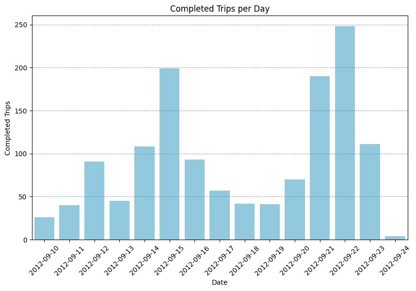
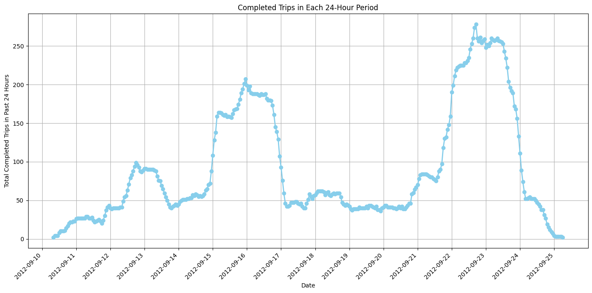
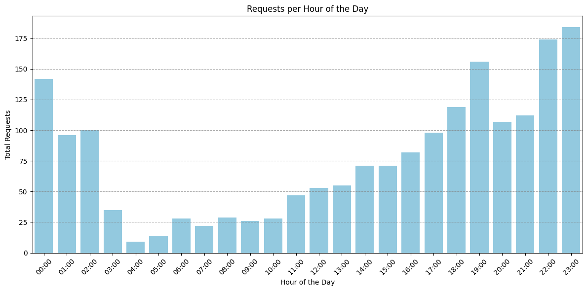
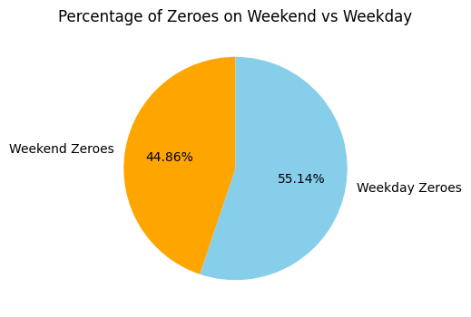
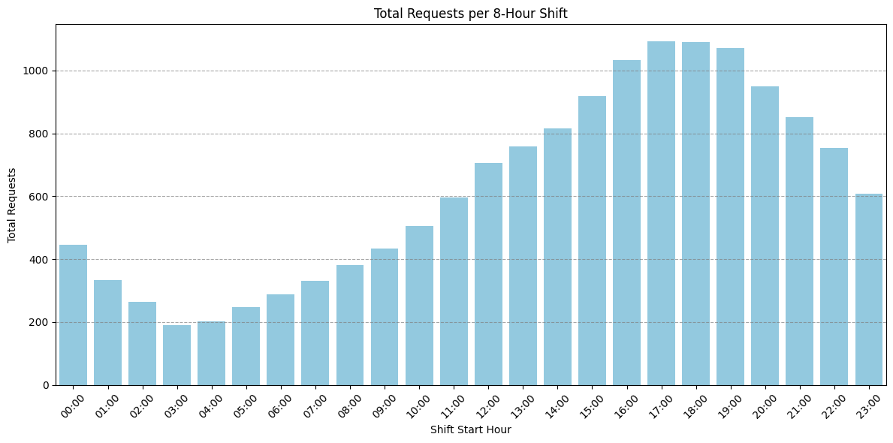
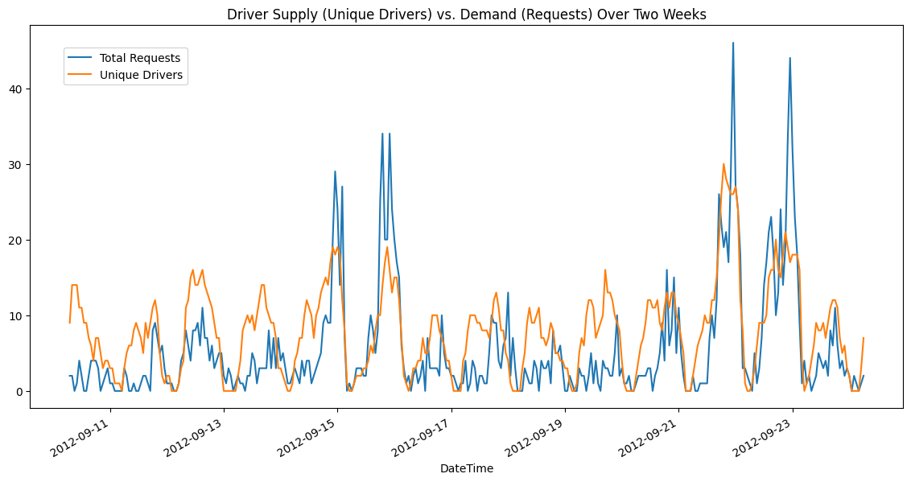
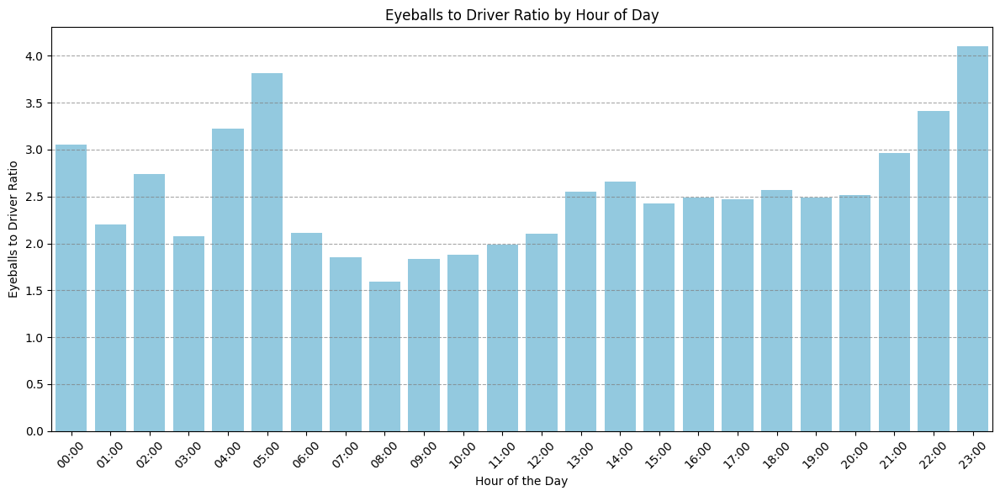
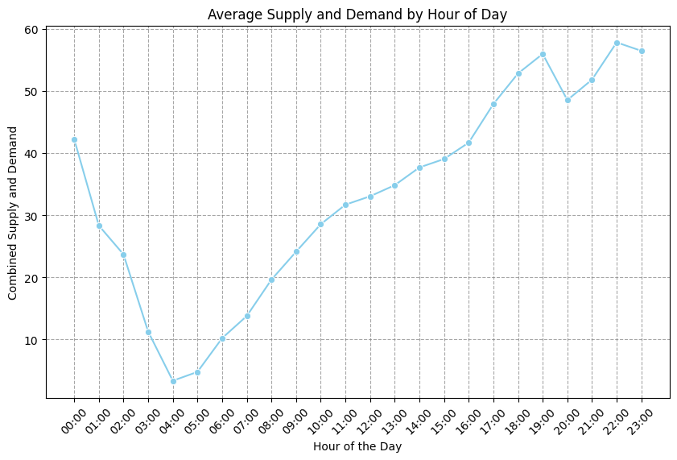

# Uber Data Analysis
## Project Overview and Business Goals
Uber stakeholders handed me a two-weeks long, specific area dataset along with 10 questions that expected me to answer in order to help them take informed decisions.

## Procedure Followed
Cleaned the dataset using Pandas, loaded it in a Spark dataframe and started looking for answers!

## Questions
1. Which date had the most completed trips during the two-week period?

Date with most completed trips: 2012-09-22  
Completed trips that day: 248  

2. What was the highest number of completed trips within a 24-hour period?

The highest number of completed trips within a 24-hour period was: 278  
The specific 24-hour window with the highest number of completed trips was from 21-09-12 17:00 to 22-09-12 17:00  

3. Which hour of the day had the most requests during the two-week period?

The hour of the day with the most requests was: 23:00 with 184 requests  

4. What percentages of all zeroes during the two-week period occurred on weekend (Friday at 5 pm to Sunday at 3 am)?  
*Tip: The local time value is the start of the hour (e.g. 15 is the hour from 3:00 pm - 4:00 pm)*

The percentage of zeroes that occurred on weekend was 44.86%  

5. What is the weighted average ratio of completed trips per driver during the two-week period?  
*Tip: “Weighted average” means your answer should account for the total trip volume in each hour to determine the most accurate number in the whole period.*  

The weighted average ratio of completed trips per driver during the two-week period is: 0.83  

6. In drafting a driver schedule in terms of 8 hours shifts, when are the busiest 8 consecutive hours over the two-week period in terms of unique requests? A new shift starts every 8 hours. Assume that a driver will work the same shift each day.

The busiest 8-hour shift over the two-week period starts at 17:00 and ends at 01:00 with 1092 total requests  

7. True or False: Driver supply always increases when demand increases during the two-week period.  
*Tip: Visualize the data to confirm your answer if needed.*

We can definitely see a 24h pattern in Unique Drivers number which tries (but often fails) to follow Requests volume and general trend however there are also many occasions when Requests rise but Unique Drivers decrease. For example the last hours of 16-09 where Unique Drivers decline after peaking while TotalRequests climb to their local peak and the TotalRequests peaks between 21-09 and 23-09 that happen when Unique Drivers number has already started going down. So the "driver supply always increases when demand increases" statement is False  

8. In which 72-hour period is the ratio of Zeroes to Eyeballs the highest?  

The 72-hour period with the highest Zeroes to Eyeballs ratio is between 15-09-12 05:00 and 18-09-12 05:00 reaching 0.29  

9. If you could add 5 drivers to any single hour of every day during the two-week period, which hour should you add them to?  
*Hint: Consider both rider eyeballs and driver supply when choosing*

The best hour to add 5 drivers is 23:00 with an eyeballs to driver ratio of 4.10  
After adjustment, the best hour to add 5 drivers is 23:00 with an adjusted eyeballs to driver ratio of 3.94  

10. Looking at the data from all two weeks, which time might make the most sense to consider a true “end day” instead of midnight? (i.e when are supply and demand at both their natural minimums)

The optimal end day hour is 04:00 with an average combined supply and demand value of 3.36  

## Closing remark
These answers should help stakeholders, drivers and the service itself maximize efficiency and improve customer experience.